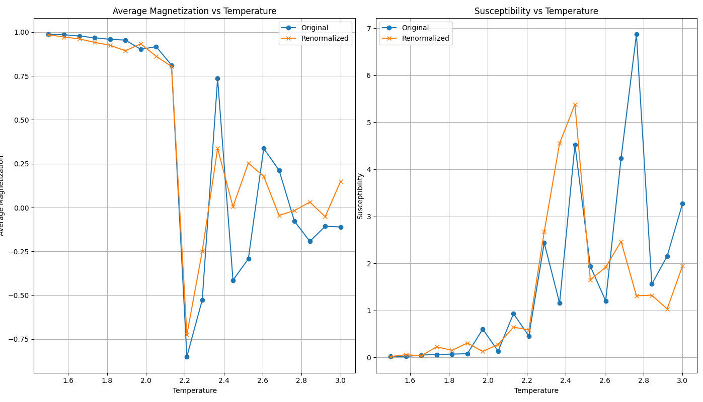

---

# Ising Model Renormalization Simulation 🌡️🔬



---

## Introduction 🎉

Welcome to the Ising Model Renormalization Simulation, a computational project that offers insights into statistical mechanics, phase transitions, and critical phenomena! 

---

## Features 🚀

- **Monte Carlo Simulation**: Simulations to explore the Ising model.
- **Renormalization Analysis**: Understand scale transformations and critical phenomena.
- **Parallel Computing**: Optimized for multi-process parallelization.
- **Visualizations**: Plot magnetization, susceptibility, and more.
- **Advanced Analysis**: Includes metrics like correlation length and Binder cumulant.
- **Well-Documented**: Comprehensive inline comments and a detailed README.

---

## Getting Started 🏁

### Prerequisites 🛠️

- Python 3.x
- Matplotlib
- NumPy
- SciPy

### Installation 📦

To get started, clone the repository and install the required packages:

```bash
git clone https://github.com/joseph-crowley/ising-model.git
cd ising-model 
pip install -r numpy scipy matplotlib
```

### Running the Simulation 🎮

Run the `main.py` script:

```bash
python main.py
```

The simulation will execute, and the results will be visualized and saved automatically. 📈

---

## Code Structure 🏗️

The project is organized as follows:

- `main.py`: The starting point for the simulation.
- `constants.py`: Houses all the physical and simulation parameters.
- `utils.py`: Utility functions for energy calculations and more.
- `simulation.py`: Core logic for the Monte Carlo simulation.
- `visualization.py`: Plotting and visualization code.

---

## Advanced Usage 🎛️

The code is modular and documented, making it easy to extend:

- Change simulation parameters in `constants.py`.
- Add new metrics in `utils.py`.
- Build upon `simulation.py` and `visualization.py` for more specialized use-cases.

---

## Contributing 🤝

Contributions are welcome! Create a PR with new functionality!

---

## License 📝

This project is licensed under the MIT License - see [LICENSE.md](LICENSE.md) for details.

---
